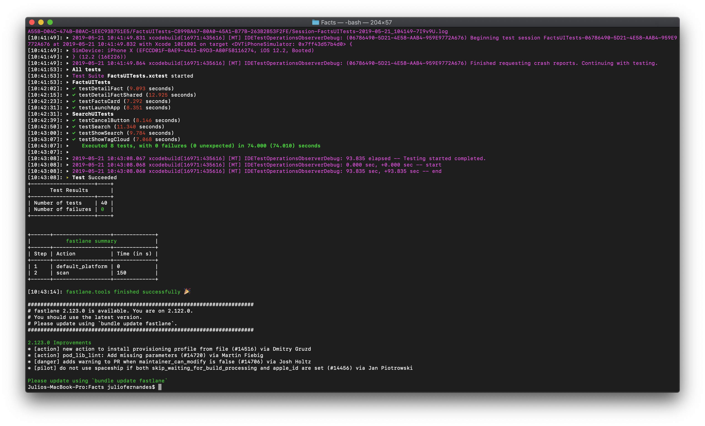

# ChuckNorris

Uma pequena aplicação que consome dados da API dos fatos do Chuck Norris.

## O Projeto

Para acompanhamento das Issues e Milestones você pode acessar:
[https://github.com/jjfernandes87/ChuckNorris/issues](https://github.com/jjfernandes87/ChuckNorris/issues)

Criei também um Guia (board) do projeto que você pode acessar: 
[https://github.com/users/jjfernandes87/projects/1](https://github.com/users/jjfernandes87/projects/1)

A API do Chuck Norris eu achei ela talvez confusa, você é obrigado a passar um termo para retornar a lista, passar vazio retorna erro, quando busca por categorias retorna termo unico. 

## Passo a passo de como rodar o projeto

Antes de tudo você precisa instalar o Bundler. Bundler garante que todos os desenvolvedores que trabalhem no projeto usem as mesmas versões de serviços como Cocoapods e Fastlane.

Abra o terminal e use o seguindo comando para instalar o Bundler:

```
gem install bundler
```

Para executar a aplicação, siga o comando abaixo::

```
cd Facts/
bundle install
```

O ultimo comando instalará todas as dependencias necessárias para rodar a aplicação:

```
bundle exec pod install
```

## Passo a passo de como testar a aplicação

Se você quiser rodar os testes localmente, basta usar o fastlane:

```
bundle exec fastlane tests
```

Se você quiser ver a cobertura de testes

```
bundle exec fastlane coverage
```

Se você quiser ver os screenshots

```
bundle exec fastlane screenshots
```

## Arquitetura

Para esse projeto foi usado o VIPER, sendo uma forma de usar a Clean Architecture e assim fazer as interações entre as camadas propostas pelo Uncle Bob. 
VIPER é formado pelas seguintes palavras: 

View -> Telas

Interactor -> Regras de negócio à nível de aplicação

Presenter -> Transformam dados para serem apresentados ou encaminhados para a interactor

Entity -> Value Objects ou lógicas reaproveitáveis

Router -> Guia de fluxo de telas

### Pastas

- Utils
    - Extension
    - TagCollectionView
- Models
    - CoreData
    - Entities
- Components
    - RXService
    - LaunchApplication
    - CollectionViewCell
    - BaseViewController
    - Services
    - SharedContent
    - TableViewCells
- Modules
    - Facts
        - View
        - Detail
        - Collection
    - Search
- Resources
    - Launch
    - Config
    - CoreData
    - Images
- Base

### Testes

Para esse projeto foi usado o Quick & Nimble para os testes unitários e o XCUITest para os de interface

Alem disso estou usando fastlane Snapshot 

### Frameworks
	
###### Externos:
- pod 'Alamofire'
- pod 'Quick'
- pod 'Nimble'

###### Próprios:
- pod 'SelfTableViewManager'
- pod 'ConfigurationProvider'
- pod 'LaunchApplication'

###### Framework: SelfTableViewManager

Lib propria que abstrai o uso da tableview, e usa uma arquitetura de MVVM. Sua ViewController ou Presenter fica livre dos dataSource da tableview como cellForRow, etc. Você trabalha com um array de viewModels (cellController)

###### Framework: ConfigurationProvider

Lib propria que permite que você crie diferentes schemes para sua aplicação e rode diversos ambientes, alem de guardar todos as configurações do seu app em um unico lugar. Você pode configurar variaveis globais e também configurar urls de API's

###### Framework: LaunchApplication

Lib propria que permite você criar uma sequencia de inicialização do seu app. Você remove metodos que poderiam ficar perdidos no AppDelegate e move para uma sequencia que você define. Tudo via array

## Sobre o desenvolvimento

###### Extra I: Auto retry

Para esse item foi pedido Reactive Programming, então para isso foi usado RXSwift. 

Com RX seria possivel mudar toda a aplicação e torna-la reativa, mas isso tem alguns impactos que eu considero importante e vou levantar os tópicos aqui, para explicar o motivo do meu desenvolvimento.

- RXSwift muda a forma de como você programa o seu app, de orientado a objeto, delegates e notifications para reativo. 
- Você acaba amarrando sua aplicação em uma lib terceira e acaba tendo pouco controle sobre como funciona de fato as coisas dentro do SDK
- Você precisa ter um time com conhecimento em RX, caso contrario pode ter dificuldades no dia a dia, manutenção e escalabilidade do seu app (existem inumeros exemplos de RX e cada um desenvolvido de maneira diferente)

Por esses motivos o que eu fiz foi criar uma abstração da camada de RXSwift, dessa forma eu posso:

- Trocar a lib de RX por outra no futuro que se torne melhor sem impactar em nada a aplicação
- Não deixo preso a architetura do meu app com uma lib terceira
- Não tenho import de RX pelo projeto
- Consigo trabalhar que todas as chamadas do app passem por lá e trate tudo em um unico lugar

A mesma coisa foi feita com o Alamofire, eu criei uma abstração dela para que seja possivel alterar para URLSession, AFNetwork ou qualquer lib que faça chamadas HTTP.

###### Extra II: Offline Facts

Para esse item foi usado CoreData.

Por se tratar de uma aplicação pequena, acabei tratando tudo dentro da Interactor do modulo de collection. Talvez em uma aplicação menor, separar um pouco da responsabilidades e também seguindo o conceito de SOLID ou Clean (mas a divisão de metodos ficou claro, dentro da mesma classe)

O teste pedia que a base local seria verdade para toda a aplicação, eu segui o que foi pedido, mas para não ter 'import CoreData' na aplicação, eu fiz um parse entre objetos e acabo utilizando uma classe (mesma usada na parse da API). Com isso eu posso mudar no futuro para Realm que não teria impacto na aplicação, assim como no Extra I que utilizei RX em apenas uma parte eu segui o mesmo conceito e mantive a arquitetura original (é possivel acompanhar pelo historico de commit)

Os dados deveriam estar relacionados ao termo, nesse caso eu não usei o relacionamento de Coredata entre o termo buscado no modulo de search e o retorno da API, por ser uma simples String os protocolos de comunicação entre os modulos, acabei utilizando o termo digitado e salvando dentro do contexto do CoreData do proprio objeto.

Dentro da Interactor (responsável pela regra de negócio do produto) eu faço o seguinte fluxo. 

* Sempre busco o termo na API (na primeira chamada utilizo 'facts')
* Valido o retorno: se error na comunicação -> vou na base local | senão retorno erro para interface ou vazio
* Pego o resultado da API e faço o sync com o banco
* O sync por sua vez so adiciona itens novos, filtrando por id
* retorno a collection do banco e converto para o objeto final

Alguns cenários que foi testado:

* Primeiro acesso com internet e com resultado: baixa os dados, salva no banco e popula a interface
* Primeiro acesso com internet e erro na API: baixa o dados (retry pedido no extra I se necessário) e retorna erro para a interface
* Primeiro acesso sem internet: baixa os dados (retry pedido no extra I se necessário) e retorna erro para a interface
* Segundo acesso com internet e dados: baixa os dados, salva apenas os novos no banco e popula a interface
* Segundo acesso sem internet: baixa os dados (retry pedido no extra I se necessário) e retorna os dados locais

###### Prints

<p align="center">
  
  
</p>

###### Conslusão

Eu procurei manter uma arquitetura do começo ao fim, pelo historico de commits é possivel ver a evolução do teste. 

No começo toda chamada era feita na API e o resultado retorna para a aplicação, depois foi criado o modulo de busca seguindo o mesmo conceito. Apos a base do app feita e um MVP criado, os criterios de aceite foram ganhando forma e a aplicação passou a responder com dados locais, chamadas realizadas na abertura da aplicação, abstrações foram sendo criadas para seguir as regras do teste. 

Procurei testar boa parte da aplicação, algumas coisas ficaram de fora com interactor (podia ter extendido e criado mais mocks locais de erro), mas tudo foi testado manualmente e principalmente a teste integrado com API e Interface garante o uso correto da aplicação.

Fiz uso de libs proprias o que abre uma extensão do teste e mostra um pouco mais do meu conhecimento também.

